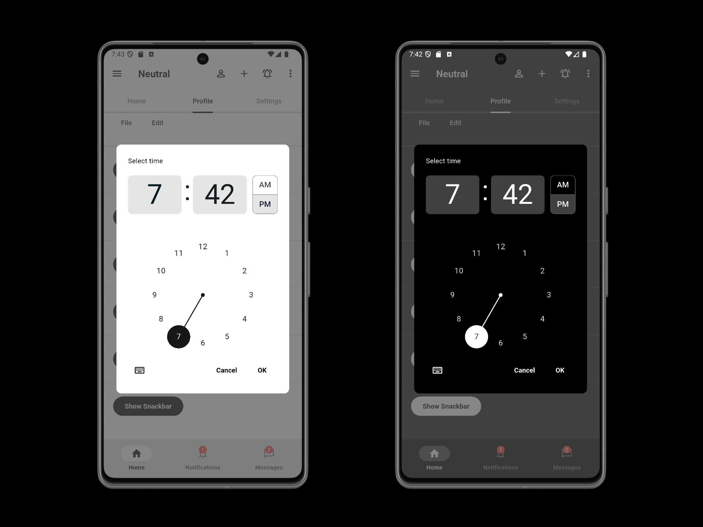
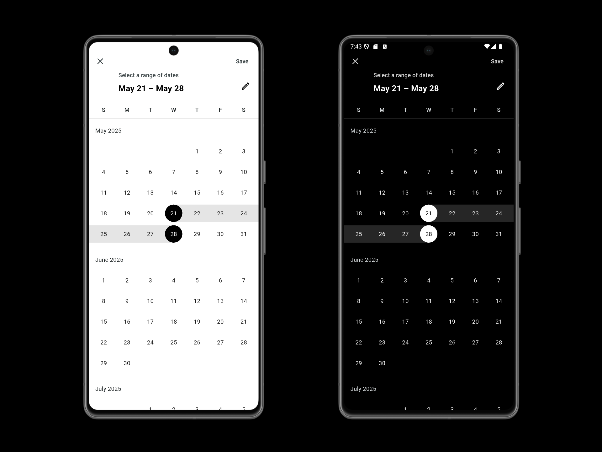

# Neutral

> Neutral color palette for Flutter theme

Reference: https://docs.flutter.dev/ui/widgets/material

## Widgets

- ✅ AlertDialog
- ✅ AppBar
- ✅ Badge
- ✅ BottomNavigationBar
- ✅ BottomSheet
- ✅ Button(Filled, Outlined, TextButton)
- ✅ Cards
- ✅ Checkbox
- ✅ Chip
- ✅ DatePicker
- ✅ Dialog
- ✅ Drawer
- ✅ Indicators(LinearProgressIndicator, CircularProgressIndicator)
- ✅ ListTile
- ✅ NavigationBar
- ✅ NavigationRail
- ✅ PopupMenu(MenuItem, Submenu)
- ✅ RadioButton
- ✅ SegmentedButton
- ✅ Slider
- ✅ SnackBar
- ✅ Switch
- ✅ TabBar
- ✅ TextButton
- ✅ TextField
- ✅ TextSelection
- ✅ TimePicker
- ✅ SearchAnchor

## Install

This is a unpublished package, so you need to add it to your `pubspec.yaml` file.

```yml
dependencies:
  neutral:
    git:
      url: https://github.com/carllosnc/neutral.git
```

To more information about unplublished packages, see: https://dart.dev/tools/pub/package-layout#unpublished-pac


## Usage

```dart
import 'package:neutral/neutral.dart';
...
MaterialApp(
  theme: neutralLightTheme(),
  darkTheme: neutralDarkTheme(),
);
...
```

- `neutralLightTheme()` - Apply light theme
- `neutralDarkTheme()` - Apply dark theme
- `neutralColor` - Neutral color palette

## Color Palette

| Index | Hex Color | Example Usage |
|-------|-----------|---------------|
| 50 | `0xFFFAFAFA` | `neutralColor.shade50` |
| 100 | `0xFFF5F5F5` | `neutralColor.shade100` |
| 200 | `0xFFE5E5E5` | `neutralColor.shade200` |
| 300 | `0xFFD4D4D4` | `neutralColor.shade300` |
| 400 | `0xFFA3A3A3` | `neutralColor.shade400` |
| 500 | `0xFF737373` | `neutralColor.shade500` |
| 600 | `0xFF525252` | `neutralColor.shade600` |
| 700 | `0xFF404040` | `neutralColor.shade700` |
| 800 | `0xFF262626` | `neutralColor.shade800` |
| 900 | `0xFF171717` | `neutralColor.shade900` |

## Examples





---

Carlos Costa @ 2025
