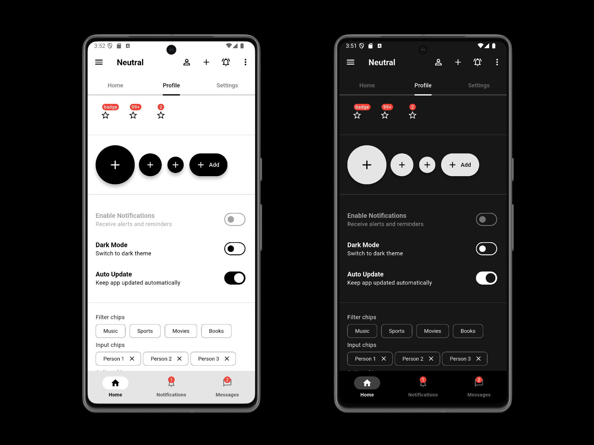
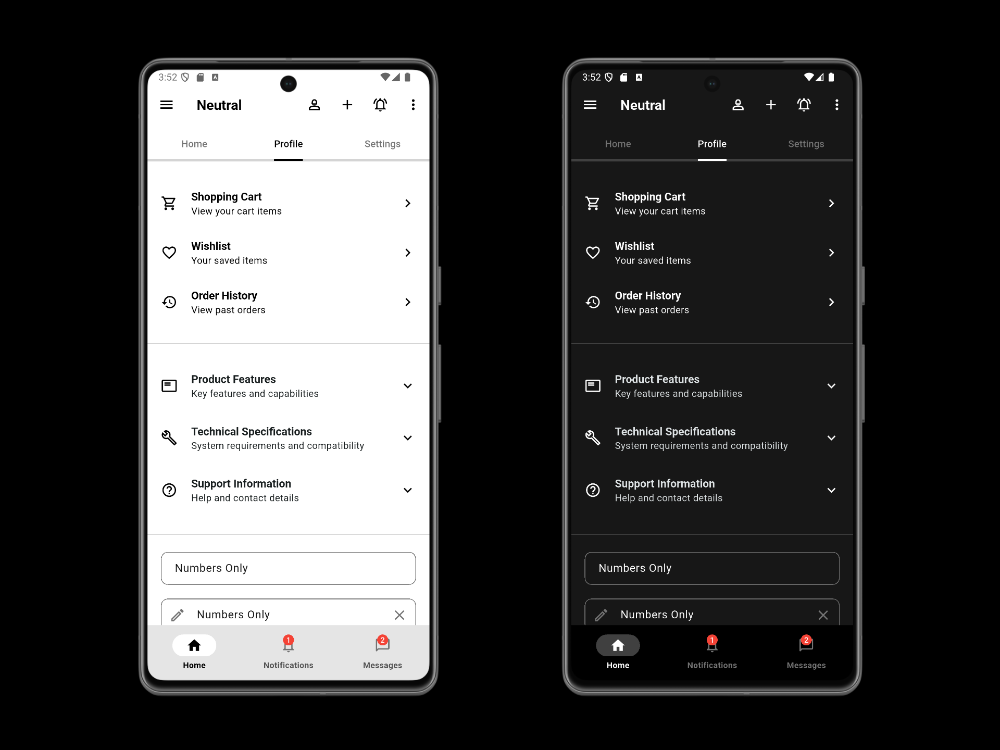
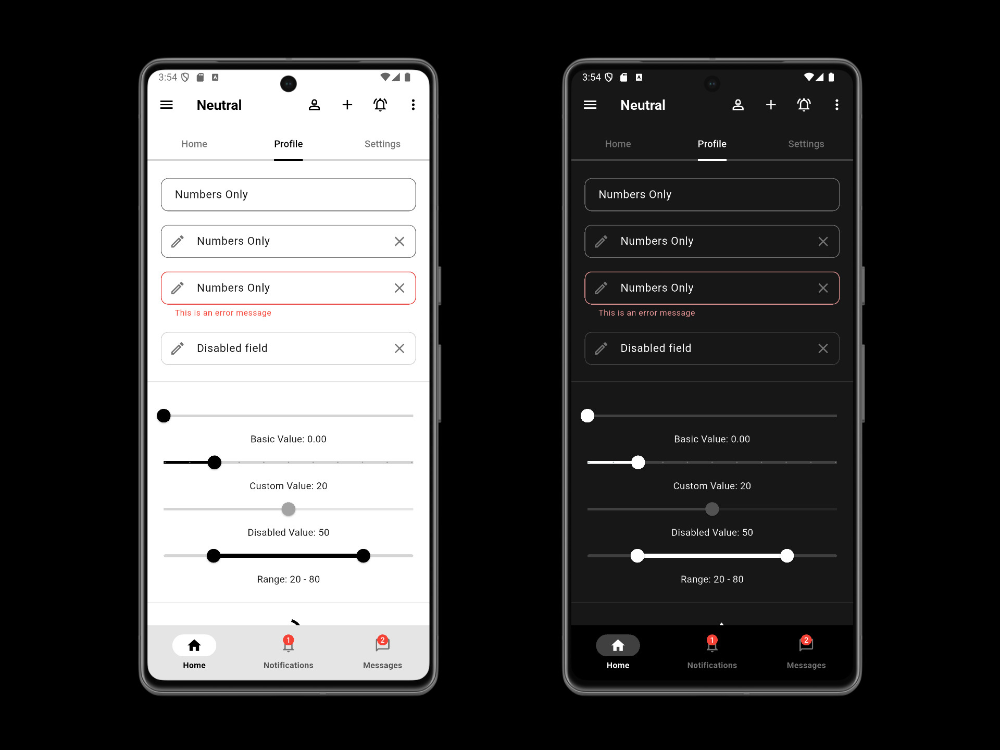
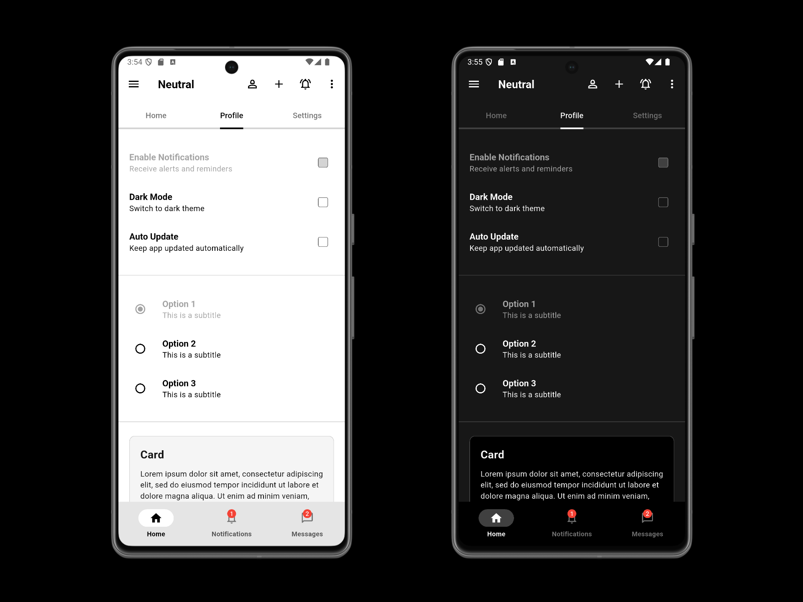

# Neutral

> Neutral color palette for Flutter theme

Reference: https://docs.flutter.dev/ui/widgets/material

### Widgets

- ✅ AlertDialog
- ✅ AppBar
- ✅ Badge
- ✅ BottomNavigationBar
- ✅ BottomSheet
- ✅ Button(Filled, Outlined, TextButton)
- ✅ Cards
- ✅ Checkbox
- ✅ Chip
- ✅ DatePicker
- ✅ Dialog
- ✅ Drawer
- ✅ Indicators(LinearProgressIndicator, CircularProgressIndicator)
- ✅ ListTile
- ✅ NavigationBar
- ✅ NavigationRail
- ✅ PopupMenu(MenuItem, Submenu)
- ✅ RadioButton
- ✅ SegmentedButton
- ✅ Slider
- ✅ SnackBar
- ✅ Switch
- ✅ TabBar
- ✅ TextButton
- ✅ TextField
- ✅ TextSelection
- ✅ TimePicker

### Examples

---

Carlos Costa @ 2025