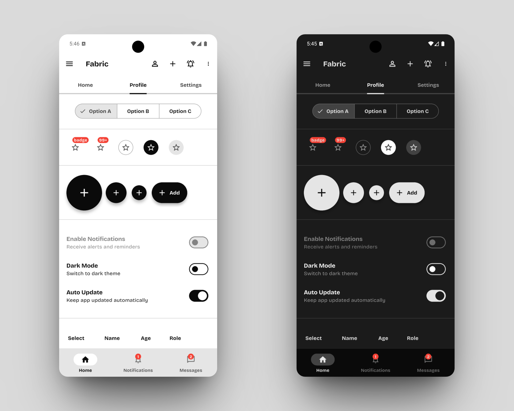
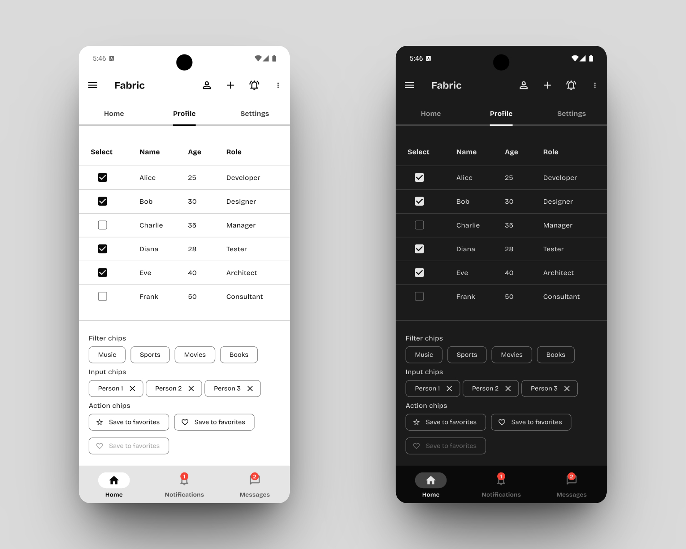
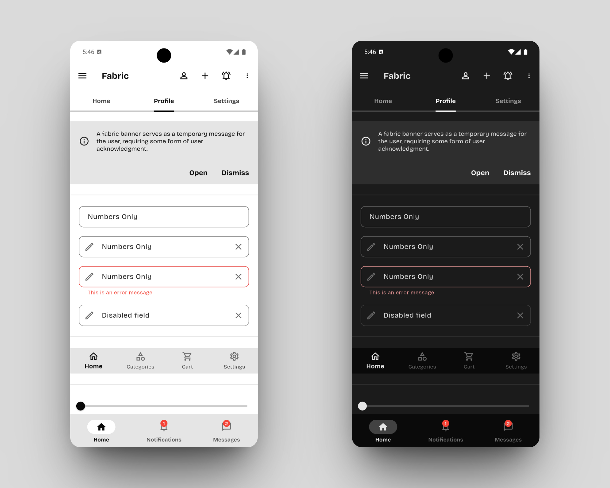

# Fabric

A beautiful, customizable Material 3 theme system for Flutter applications. Fabric provides a comprehensive set of pre-styled widgets with consistent design language and easy customization options.

[](https://github.com/carllosnc/fabric)
[](https://flutter.dev)
[](https://dart.dev)

## Features

- **Material 3 Design System** - Built on the latest Material Design principles
- **Light & Dark Themes** - Automatic theme switching support
- **30+ Styled Widgets** - Comprehensive widget coverage
- **Custom Color Palettes** - Pre-built color swatches with easy customization
- **Responsive Design** - Optimized for all screen sizes
- **Easy Integration** - Simple setup with minimal configuration

## Installation

Add Fabric to your `pubspec.yaml` file:

```yaml
dependencies:
  fabric:
    git:
      url: https://github.com/carllosnc/fabric.git
```

Then run:
```bash
flutter pub get
```

> **Note:** This is currently an unpublished package. For more information about Git dependencies, see the [official documentation](https://dart.dev/tools/pub/dependencies#git-packages).

## Quick Start

```dart
import 'package:fabric/fabric.dart';
import 'package:flutter/material.dart';

void main() {
  // Optional: Customize theme before app starts
  fabricConfig.color = fabricBlue;
  fabricConfig.fontFamily = "Inter";

  runApp(MyApp());
}

class MyApp extends StatelessWidget {
  @override
  Widget build(BuildContext context) {
    return MaterialApp(
      title: 'Fabric Demo',
      theme: fabricConfig.getLightTheme(),
      darkTheme: fabricConfig.getDarkTheme(),
      themeMode: ThemeMode.system, // Automatic theme switching
      home: MyHomePage(),
    );
  }
}
```

## Supported Widgets

Fabric provides consistent styling for all major Material widgets:

### Fully Supported
| Widget Category | Widgets |
|-----------------|---------|
| **Navigation** | AppBar, BottomNavigationBar, Drawer, NavigationBar, NavigationRail, TabBar |
| **Input** | TextField, Checkbox, RadioButton, Switch, Slider, DatePicker, TimePicker |
| **Buttons** | ElevatedButton, OutlinedButton, TextButton, SegmentedButton |
| **Display** | Cards, Chip, Badge, ListTile, DataTable |
| **Feedback** | Dialog, AlertDialog, BottomSheet, SnackBar, MaterialBanner |
| **Progress** | LinearProgressIndicator, CircularProgressIndicator |
| **Other** | Scaffold, SearchAnchor, PopupMenu, Text, TextSelection |

### Known Limitations
- **Stepper** - [Flutter issue #102558](https://github.com/flutter/flutter/issues/102558) - Widget doesn't use theme data for styling

## Configuration

The `fabricConfig` object is your main interface for customizing Fabric themes.

### Available Properties

| Property | Type | Description | Default |
|----------|------|-------------|---------|
| `color` | `FabricSwatch` | Primary color palette for the theme | `fabricGrey` |
| `fontFamily` | `String?` | Custom font family name | `null` |

### Available Methods

| Method | Return Type | Description |
|--------|-------------|-------------|
| `getLightTheme()` | `ThemeData` | Returns configured light theme |
| `getDarkTheme()` | `ThemeData` | Returns configured dark theme |

### Customization Examples

**Basic Theme Setup:**
```dart
import 'package:fabric/fabric.dart';

void main() {
  // Set primary color
  fabricConfig.color = fabricBlue;

  // Set custom font
  fabricConfig.fontFamily = "Inter";

  runApp(MyApp());
}
```

**Advanced Configuration:**
```dart
// Using different colors for different app sections
fabricConfig.color = fabricGreen; // Nature app
// or
fabricConfig.color = fabricRed;   // Alert/Emergency app
```

> **Font Limitations**
> Fabric currently doesn't support the `google_fonts` package directly. Use system fonts or manually add custom fonts to your project.

## Color System

Fabric includes carefully crafted color palettes that work beautifully in both light and dark themes.

### Built-in Color Palettes

| Palette | Description | Best For |
|---------|-------------|----------|
| `fabricGrey` | Neutral grays | Professional, minimal apps |
| `fabricBlue` | Cool blues | Business, productivity apps |
| `fabricRed` | Warm reds | Alert systems, emergency apps |
| `fabricGreen` | Natural greens | Health, nature, finance apps |

### Using Color Palettes

```dart
// Set the primary color for your entire app
fabricConfig.color = fabricBlue;

// Access individual shades
Color lightBlue = fabricBlue[100]!;  // Light shade
Color darkBlue = fabricBlue[900]!;   // Dark shade
```

### Creating Custom Color Palettes

You can create your own color palette using the `FabricSwatch` class:

```dart
FabricSwatch myCustomColor = FabricSwatch(
  0xFF6366F1, // Primary color value
  <int, Color>{
    50: Color(0xFFEEF2FF),   // Lightest
    100: Color(0xFFE0E7FF),
    200: Color(0xFFC7D2FE),
    300: Color(0xFFA5B4FC),
    400: Color(0xFF818CF8),
    500: Color(0xFF6366F1),  // Primary (matches constructor)
    600: Color(0xFF4F46E5),
    700: Color(0xFF4338CA),
    800: Color(0xFF3730A3),
    900: Color(0xFF312E81),  // Darkest
    950: Color(0xFF1E1B4B),
  },
);

// Use your custom palette
fabricConfig.color = myCustomColor;
```

### Color Shade System

The `FabricSwatch` extends Flutter's `ColorSwatch` to provide:
- **50-950 shade range** - From lightest to darkest
- **Consistent naming** - Same shade numbers across all palettes
- **Theme integration** - Automatic light/dark theme adaptation

## Examples







## Recommended Fonts

Fabric works great with these modern font families:

| Font Family | Style | Best For |
|-------------|-------|----------|
| [Inter](https://fonts.google.com/specimen/Inter) | Clean, readable | UI text, body content |
| [Roboto](https://fonts.google.com/specimen/Roboto) | Material Design | Android-style apps |
| [Schibsted Grotesk](https://fonts.google.com/specimen/Schibsted+Grotesk) | Modern, geometric | Headlines, branding |
| [Bricolage Grotesque](https://fonts.google.com/specimen/Bricolage+Grotesque) | Quirky, friendly | Creative, playful apps |
| [Hanken Grotesk](https://fonts.google.com/specimen/Hanken+Grotesk) | Professional | Business applications |
| [Geist](https://fonts.google.com/specimen/Geist) | Technical, clean | Developer tools, dashboards |

## Known Issues & Limitations

- **Stepper Widget**: Due to [Flutter issue #102558](https://github.com/flutter/flutter/issues/102558), the Stepper widget doesn't respect theme colors
- **Google Fonts**: Direct integration with `google_fonts` package is not yet supported

## Resources & References

| Resource | Description |
|----------|-------------|
| [Material 3 Design](https://m3.material.io/) | Official Material Design 3 guidelines |
| [Flutter Material Widgets](https://docs.flutter.dev/ui/widgets/material) | Flutter's Material widget documentation |
| [Color Palette Generator](https://colorkit.co/color-shades-generator/) | Tool for creating custom color shades |

## Contributing

Contributions are welcome! Please feel free to submit issues, feature requests, or pull requests.

## License

This project is licensed under the MIT License - see the [LICENSE](LICENSE) file for details.

---

**Made by [Carlos Costa](https://github.com/carllosnc) © 2025**
